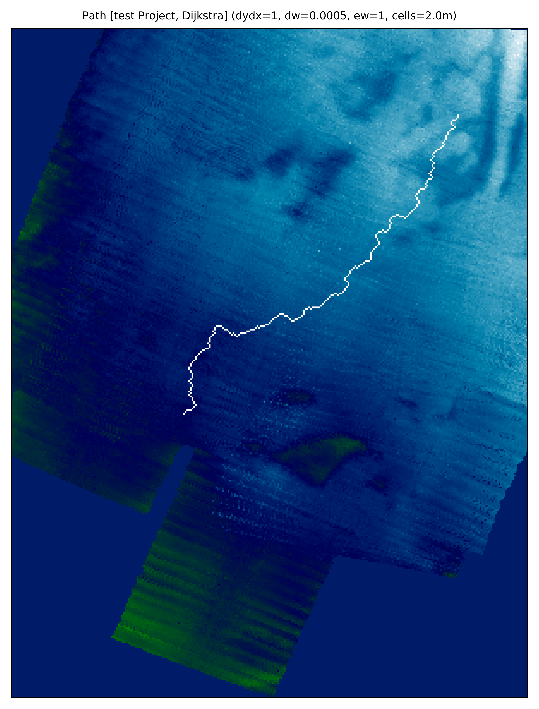

<!-- markdownlint-configure-file {
  "MD013": {
    "code_blocks": false,
    "tables": false
  },
  "MD033": false,
  "MD041": false
} -->

# Automated Pipeline Tool

An automated routing tool capable of laying the **shortest feasible pipeline route**, on a given raster.  
Inspired by Dijkstra's algorithm. 
Built for use across the mining, municipals, and oil & gas industries.

[Getting started](#getting-started) •
[Running the tool](#running-the-tool) •
[Deployment](#deployment) •
[Built With](#built-with) •
[Contributing](#contributing) •
[Versioning](#running-the-tool) •
[Authors](#authors) •
[License](#license) •

- Maps converted to slop maps, rather than elevation maps to better approximate shortest distance over large lengths
- Option to select the algorithm heuristic allows for flexibility in route calculation
- edge costs are only re-calculated if changes in the options are made, requiring them to be re-calculated
- No limit to the input .xyz raster size. Loading bar provides feedback to the progress of the calculation for larger input files.
- Multiple library combinations tested to create the most efficient calculation. These include: pandas for data processing, and networkx for shortest path algorithm computation.
- This was required due to the fact that calculations for larger maps require an exponential increase in computing/processing power, due to the exponential increase in the number of node interactions on a map. Also ties in with the fact that edge costs are computed and exported to improvde efficiency if calculations need to be re-run. The tool therefore needed to be as efficient as possible.
- INPUTS:
-   know your start and end coordinates (in northing and easting format)
-   a raster file in .xyz format, with columns: NORTHING, EASTING, ELEVATION. Delimiter spacing can be adjusted in the input section of the script.
-   Various optional settings that may be adjusted:
-     - the option to convert the raster from an elevation profile into a slope profile. This is often seen as useful in the mining and o&g industry, as it enables the algorithm to search for the nearest, shortest cost slopes, rather than individual elevational nodes.
OUTPUTS:
- a .png plot showcasing the route on the elevation/slope profile.
- an .xyz file of the final route
- a .txt file containing the computed edgecosts for the affamentioned route. This enables the tool to re-run the algorithm without re-computing these edgecosts, usually a timely calculation.

## Getting started

## Running the tool

## Deployment

## Built With
Python 3
Spyder 3
Libraries (internal):
-   datetime
-   sys
-   os
-   math
-   numpy
-   matplotlib
Libraries (external):
-   pandas
-   networkx
-   tqdm

## Contributing

Please read [CONTRIBUTING.md](https://gist.github.com/PurpleBooth/b24679402957c63ec426) for details on our code of conduct, and the process for submitting pull requests to us.

## Versioning

We use [SemVer](http://semver.org/) for versioning. For the versions available, see the [tags on this repository](https://github.com/your/project/tags).

## Authors
* **Walid Hanifi** - *Initial work* - [Waldorfio](https://github.com/Waldorfio)

See also the list of [contributors](https://github.com/your/project/contributors) who participated in this project.

## License
This project is licensed under the MIT License - see the [LICENSE.md](LICENSE.md) file for details
